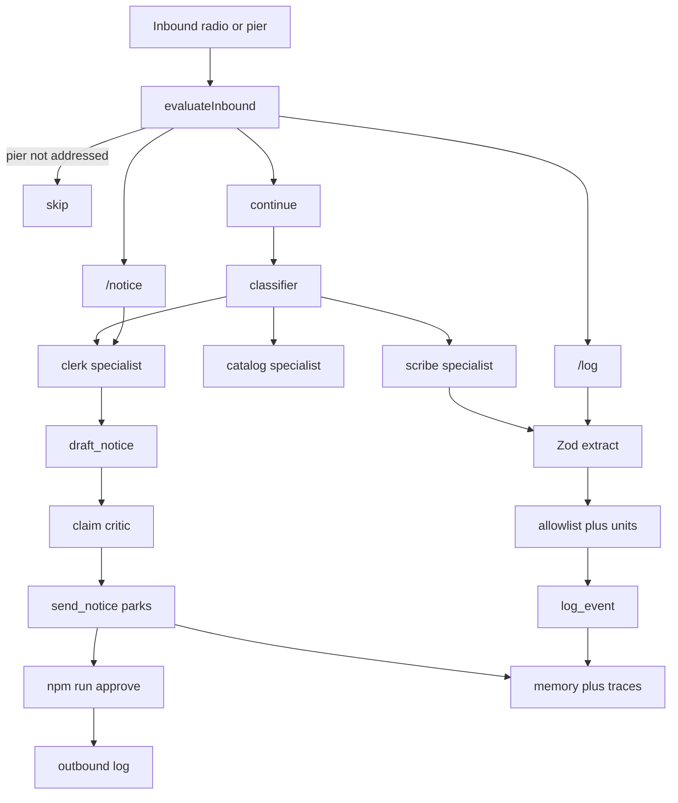

# Architecture

Sanitized slice of a private production system (patterns and contracts only). Author: Talles Hentges. Fictional domain: **harbor desk**.

## Thesis

**The graph and catalog own truth. The LLM fills JSON.**

Inbound radio/pier messages hit a deterministic policy machine. Commands and free-text may call a model for extraction or routing into one specialist seat. Server-side allowlists, unit conversion, and a critic decide what is real. Risky outbound sends park for a human.

## Module map

| Concern                      | Module                                 |
| ---------------------------- | -------------------------------------- |
| Entrypoint loop              | `src/orchestration/run.ts`             |
| Inbound policy               | `src/orchestration/evaluateInbound.ts` |
| Classifier / critic          | `src/agents/`                          |
| Catalog + extract + tools    | `src/tools/`                           |
| Allowlists / units           | `src/guardrails/`                      |
| HITL park / approve          | `src/hitl/` + `scripts/approve.ts`     |
| Scratchpad + long-term notes | `src/memory/`                          |
| Trace types + JSON           | `src/tracing/`                         |
| OpenAI-compatible LLM        | `src/llm/`                             |
| Live demo                    | `scripts/demo.ts`                      |

## Production → demo collapse

| Production pattern                                   | Demo                                                                            |
| ---------------------------------------------------- | ------------------------------------------------------------------------------- |
| Redis claim / lease / dequeue workers                | In-process `run()` — same “one message, one operation” contract, no broker      |
| Postgres chat + core DBs                             | In-memory event store + `var/` files                                            |
| Multi-provider LLM failover chain                    | Single OpenAI-compatible adapter (`LLM_API_KEY` + `LLM_BASE_URL` + `LLM_MODEL`) |
| HTTP tool surface (MCP wrapper optional later)       | Typed functions + JSON Schema/Zod — no MCP wire                                 |
| Ops seats (classifier → one specialist; human sends) | `classify` → catalog/scribe/clerk; `send_notice` parks                          |
| Match-before-mint + metric allowlist                 | `match_vessel_or_slip` + `validateEventsAgainstCatalog`                         |
| Memory attribution exclude-other                     | `excludeFromSelfContext` on `attribution: 'other'`                              |
| operationId + completion metadata                    | ULID + JSON steps (tokens, latency when present)                                |
| Golden / mock-LLM floor tests                        | `node:test` + `evals/*.goldens.json`                                            |

## Trust boundaries

1. **Pier** messages are ignored unless addressed (`desk` / `@harbor` / reply).
2. Model output is untrusted until allowlist + unit conversion succeed.
3. Unknown vessels/slips become **proposals**, never silent new ids.
4. Critic rejects claims whose vessels/slips/numbers are not grounded in source text.
5. **`send_notice` does not send** on the default path — it writes `var/pending/` and stops.
6. Live network only in `npm run demo` (and only with a configured key).

## HITL

- Default: park → `npm run approve -- <operationId>`.
- Escape hatch: `npm run demo -- --yes` (auto-approve). Documented last on purpose — reviewers should see the park.

## Memory policy

- **Scratchpad**: per-thread ephemeral lines for the current run.
- **Long-term** (`var/memory.json`): notes with `attribution: 'self' | 'other'`.
- **Retrieve for self context**: omits notes tagged `attribution: 'other'` so third-party notes are not injected into the desk’s own prompt context (writes of `other` still require `otherName`).
- **Write**: successful `/log` events append a self note (`npm run demo` 2nd op → `var/memory.json`); identical content hashes are skipped.

## Traces

Each run can write `var/traces/<operationId>.json` (pretty-printed array):

- Entry 0: run header (`record: run`, status, timestamps, step count)
- Following entries: `{ record: step, step: TraceStep }` including `tokens` / `latencyMs` when available

User-oriented walkthrough of statuses and step types: [`briefing/flow.md`](briefing/flow.md#making-sense-of-vartracesjson).
