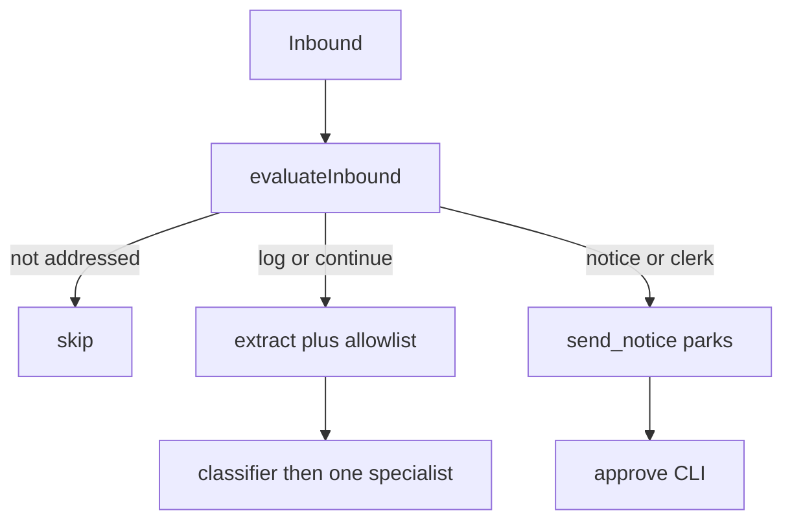

# agentic-workbench

A small, readable **harbor-desk** agent loop by **Talles Hentges**.

Sanitized showcase of agentic patterns from a private production system — not a product dump. Clone it, set one API key, and run in under 10 minutes.

## What this is / is not

| Is                                                      | Is not                                               |
| ------------------------------------------------------- | ---------------------------------------------------- |
| One working pipeline you can read in one sitting        | A dump of a private codebase                         |
| Patterns: policy graph, allowlists, HITL, traces, evals | Training / wellness / companion product domain       |
| OpenAI-compatible LLM adapter                           | Postgres, Redis, Expo, Docker, k8s, or a message bus |
| A sanitized slice of a private system                   | The production brand, prompts, or customer data      |

## Architecture (overview)



Details and production→demo collapse: [`ARCHITECTURE.md`](ARCHITECTURE.md). How the flow works (with examples + reading traces): [`briefing/flow.md`](briefing/flow.md). Short reviewer checklist: [`briefing/happy-path.md`](briefing/happy-path.md). What human review changed in the final docs/demo PR: [`briefing/human-review-pr5.md`](briefing/human-review-pr5.md).

## How to run

```sh
cp .env.example .env    # set LLM_API_KEY (and optional LLM_BASE_URL / LLM_MODEL)
npm install
npm test                # mock model — no network
npm run typecheck
npm run demo            # ambiguous /log, successful /log (+ memory), parked /notice
npm run approve -- <operationId>   # optional: complete the send
npm run clean:var       # clear var/traces, pending, outbound, memory.json
```

`npm run demo -- --yes` auto-approves outbound send (escape hatch — not the default story).

## What a reviewer should look at first

1. [`src/orchestration/run.ts`](src/orchestration/run.ts) — the whole loop in one file
2. [`src/tools/runSpecialistPath.ts`](src/tools/runSpecialistPath.ts) — one specialist + maxSteps
3. [`ARCHITECTURE.md`](ARCHITECTURE.md) — trust boundaries and prod→demo mapping
4. [`briefing/human-review-pr5.md`](briefing/human-review-pr5.md) — human review trail for the final docs/demo PR

## Mapping table

| Production pattern                         | Demo module                                         |
| ------------------------------------------ | --------------------------------------------------- |
| Inbound policy (group only when addressed) | `src/orchestration/evaluateInbound.ts`              |
| Redis/worker claim → in-process run        | `src/orchestration/run.ts`                          |
| Ops classifier → one seat                  | `src/agents/classify.ts`                            |
| Zod extract + server allowlist             | `src/tools/extractLogEvents.ts` + `src/guardrails/` |
| Match-before-mint                          | `src/tools/catalogTools.ts`                         |
| Draft vs human send                        | `src/hitl/` + `send_notice`                         |
| Memory attribution exclude-other           | `src/memory/`                                       |
| operationId traces                         | `src/tracing/` → `var/traces/*.json`                |
| OpenAI-compatible completion               | `src/llm/`                                          |

## License

MIT © Talles Hentges
